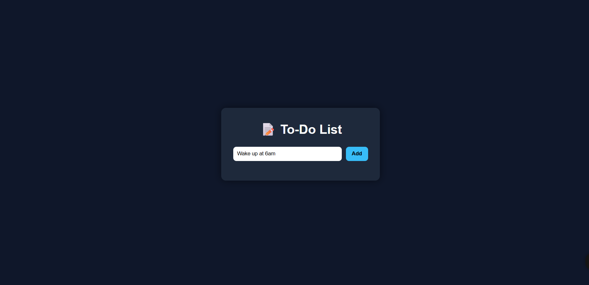
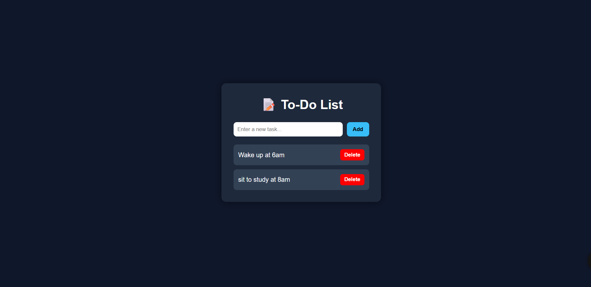

# 📝 To-Do List App

A simple and clean To-Do List application built using **HTML, CSS, and JavaScript**.

## 🚀 Features
- Add tasks
- Mark tasks as completed
- Delete tasks
- Simple and clean UI

## 🛠️ Tech Stack
- HTML
- CSS
- JavaScript

## 📸 Screenshot

## 💡 How to Use
- Type a task in the input
- Click ➕ to add
- Click on a task to remove

## 📌 How to Run
1. Download the project
2. Open `index.html` in browser

---
⭐ Made by Aryan Karn
